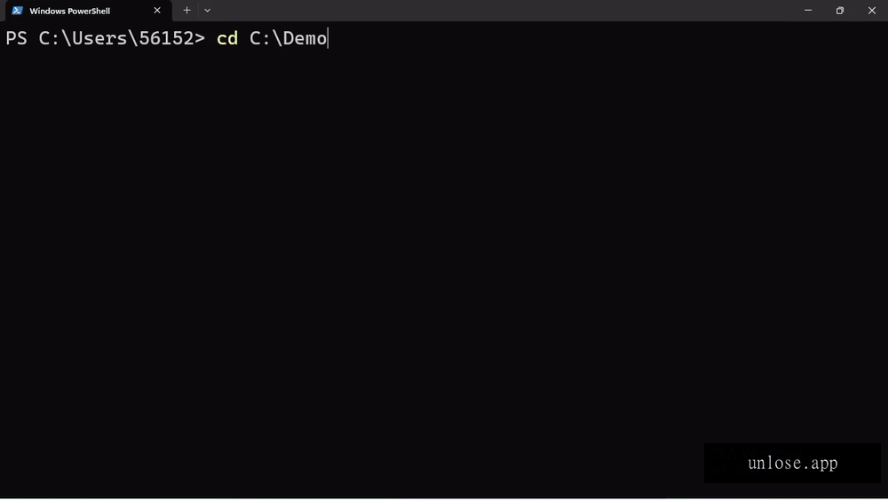

# unlose

**[English](README.md) | [简体中文](README.zh-CN.md)**

> **Unlose what your AI agent deleted. When the hook fails, the snapshot holds.**

unlose is the last line of defense for AI agent operations on Windows. Before your AI agent starts working, unlose quietly takes a full-disk snapshot. After it deletes, corrupts, or encrypts your files, you drag a timeline slider and get them back.

Not an interceptor. A time machine.


**[Website](https://unlose.app) · [Download](https://unlose.app/download) · [Docs](https://unlose.app/docs)**



---

## Why unlose exists

### The problem: AI now has permission to delete your files

AI coding tools (Claude Code, Cursor, Copilot, Gemini CLI, …) execute real operations on your machine: rewriting code, reorganizing directories, batch-processing files. They are powerful — and they make mistakes: misunderstood instructions, ambiguous commands, or manipulation into destructive actions.

This is not hypothetical. On 2026-07-10, prominent founder Matt Shumer's Mac was wiped by an AI assistant (`rm -rf` on his user directory) — and the interceptor logs told the scarier story: every blocked command was followed by a new path around it, again and again, within a single session. Even the most professional heavy user was not spared.

### The truth: interception is a losing cat-and-mouse game

The smarter the AI, the better it gets at bypassing interceptions. Block `rm -rf` and it will find another way to do the same thing. **No interceptor in the world can block every destructive path.**

Therefore, the only defense that cannot be bypassed is to **fully preserve your data before the AI acts**.

### unlose's answer: protect first, then work

```
AI starts ──► unlose snapshots automatically ──► AI works (deletes / modifies / encrypts)
                                                   │
                                             unlose: go back to the snapshot, files return
```

unlose does not guess what the AI will do. It only guarantees one thing: **whatever the AI does, you have a clean copy of "before the AI touched it."**

---

## What makes unlose different

| | Interceptors (e.g. DCG) | unlose |
|---|---|---|
| Role | First line: block dangerous commands | **Last line: snapshot safety net** |
| Approach | Guess and block destructive paths | Don't guess. Just save. |
| Bypassable? | Yes — proven by the 2026-07-10 incident | **No — the snapshot exists before the deletion** |

> **Interceptors stop the bullet. unlose is the time machine. Use both.**

**Not a recorder.** Unlike AI memory tools (Rewind, Recall), unlose never records your screen, audio, keystrokes, or file *contents* for inspection. It only keeps **filesystem snapshots** — a copy of your data at a point in time. You are the only one who ever opens them. This is a time machine, not a monitor.

**Native Windows. No WSL, no hooks.** A Windows service with a WPF desktop UI, CLI, and MCP server. Installs with a single MSI.

---

## Core capabilities

### 🛡️ Automatic snapshots — you do nothing

| Trigger | When |
|---|---|
| Scheduled | Three fixed times daily by default (08:00 / 13:00 / 18:00); can switch to interval mode (6/12/24/48h) |
| **Before AI sessions** | Detects 30+ mainstream AI agents launching; snapshots before they act |
| Pre-restore safety | Auto-snapshot before every restore, so a failed restore never costs you the current state |
| Manual / CLI / MCP | One-click, or trigger from the command line or the AI tool itself |

### 🕰️ Immersive restore — recovering files like turning a clock

- **Dual-pane timeline**: historical snapshot vs. current state, switch time points from the bottom timeline
- **Four-color diff**: deleted / modified / added files visible at a glance, with modification times
- **Line-level diff**: text files down to the line — which lines were removed (red), which are new (green), with line numbers and +X/-Y statistics
- **Lazy-loaded file tree**: deep directory structures fully browsable

### 🎯 Pick-and-choose recovery

- Select one or more files/directories (directories include their subtrees), restore to a **new directory of your choice**
- **Never overwrites current files** — zero-risk trial
- Full-volume restore also supported (with confirmation before executing)

### 🤖 30+ AI agents detected — the AI knows "back up before you act"

- Built-in detection for 30+ mainstream agents (Claude Code, Cursor, Copilot, Gemini CLI, Kimi, Qwen, Codex, DeepSeek, …) — newly installed tools work with zero configuration
- **Global memory injection (unique)**: writes a protection directive into your `~/AGENTS.md` and installed agents' global memory files — "snapshot before sessions, snapshot before dangerous operations, recover with unlose". **The AI reads it itself.** Original content preserved, injection block clearly marked, no residue after uninstall

### 📊 Real status & event log — visible, trustworthy

- Main UI shows four true states: **Protecting / Paused / Suspended (low disk) / Offline** — never a fake "all safe"
- Event log with 6 filterable categories (Agent sessions / System restores / Snapshot events / Storage alerts / Protection state / All) — every row is real
- Storage card: real disk usage + auto-snapshot status

### ⚡ Hot-reloaded configuration — save and it applies

Snapshot interval, protected volumes, low-disk threshold, agent list… save in Settings and the service **hot-reloads immediately**. No restart. Every control on the settings page is real.

### 🔗 Seamless AI toolchain integration

- **CLI** (`unlose.exe`): snapshot / status / list / restore with strict exit codes (0/1/2) — script-friendly
- **MCP Server**: AI tools call snapshot capabilities directly via MCP
- **Skill file**: the service auto-deploys an `unlose-snapshot` skill into detected agents' skill dirs — teaching the AI to "snapshot before acting" requires zero configuration

---

## Download

**[⬇ Download for Windows (x64)](https://unlose.app/download)** — one self-contained MSI (~140 MB, .NET runtime embedded, no prerequisites).

| Channel | Link | Notes |
|---|---|---|
| Website (direct) | https://unlose.app/download | Fast in mainland China (~25 s); elsewhere served from Cloudflare R2 |
| GitHub Releases | [releases/latest](https://github.com/unlose-app/unlose/releases/latest) | SHA256 in the release notes |

Both channels serve the **byte-identical** installer — verify the SHA256 against the value in the [release notes](https://github.com/unlose-app/unlose/releases/latest) or on the [docs page](https://unlose.app/docs). The installer is currently unsigned, so Windows may show "publisher cannot be verified"; this is expected and code signing is in progress. **unlose.app and this repository are the only official sources.**

---

## Quick start

```powershell
# 1. Install the MSI (see Download above) — registers the Windows service,
#    auto-starts with the system (installs to C:\Program Files\unlose\)

# 2. Take a snapshot
unlose snapshot --label "protecting before I work"

# 3. Check status & list snapshots
unlose status
unlose list-snapshots

# 4. Restore
unlose restore-snapshot <id>
```

No configuration needed: the service runs in the background, snapshots on AI startup automatically, protection is on by default. Open the main UI to see protection status and all historical time points.

**Build from source**: requires .NET 8 SDK on Windows 10/11 x64.

```powershell
dotnet build src/Unlose.sln -c Release
dotnet test src/Unlose.Tests    # 147 unit tests
```

---

## Tested, not claimed

- **147/147 unit tests** passing (retention policy, restore semantics, IPC contracts, config hot-reload, memory injection, …)
- **16/16 UI automation tests** (FlaUI) passing
- **Virtual machine e2e**: post-install 16/16, snapshot-restore 10/10, restore-point scheduling 5/5
- **Real-snapshot restore verified**: byte-for-byte SHA256 identical file recovery on a real host, including full-volume restore and ransomware-simulation recovery
- **Hot-deploy pipeline**: 3 rounds DEPLOY_OK
- **Tested on**: Windows 11 x64 (VirtualBox); agent detection 30+/30+; Pester install/e2e scripts live in `tests/` (the full VM harness is internal tooling)

## Tech notes

- **Snapshot engine**: Windows VSS shadow copies — complete point-in-time records of protected volumes, no file-system filter drivers
- **Mount & restore**: shadow copies mounted via symbolic links (`%ProgramData%\unlose\mounts\`), robocopy for file/dir copy; full-volume rollback with `/purge` semantics (anti-ransomware)
- **Path safety**: restore requests go through traversal protection (absolute paths and `..` segments rejected)
- **Storage**: SQLite (`%ProgramData%\unlose\`), retention policy: 24h full → 7d thinning → 30d cleanup; important snapshots can be 🔒 pinned forever
- **Shape**: Windows service (auto-restart on crash) + WPF desktop UI + CLI + MCP server, MSI installer
- **Language**: C# / .NET 8, UI in English & 中文 (Simplified)

## We deliberately do NOT

- ❌ **Block commands** — a losing cat-and-mouse game. That's what interceptors (DCG and friends) are for
- ❌ **Sell fear** — we only state facts and real events, never exaggerate
- ❌ **Require complex setup** — protection is on by default; the only operation is "recover"

## Roadmap

- Offsite backup (external drive / NAS sync, incremental, encrypted) — code ready, e2e validation pending
- macOS support (after Windows product-market validation)

## License & trademark

Code is licensed under the **Apache License 2.0** — see [LICENSE](LICENSE) and [NOTICE](NOTICE).

The **unlose** name and logo are trademarks of the project — see [TRADEMARK.md](TRADEMARK.md) for what you can and cannot do. **Fork it, but rename it.** If you ship a derivative, pick your own name — the community will thank you.

## About the author

Snapshot/restore has been the author's field for 25 years — his first work on restore-point triggering dates back to 2000 (US7039830B2, US7120835B2). unlose is the same answer, re-applied to the AI agent era — this time Apache-2.0, so you can verify every claim yourself.

## Enterprise

Looking for centralized management, compliance audit, or private deployment? **unlose Enterprise** is planned — [open an issue](https://github.com/unlose-app/unlose/issues) or [reach out](mailto:maintainers@unlose.dev) to express interest.

---

*unlose — Everything your AI agent deletes, unlose remembers.*
